# GetHelped — Project Walkthrough

> **A simple, picture-by-picture tour of every screen of the GetHelped website.**
> Written so anyone — even someone with no technical background — can follow.

- **Project:** GetHelped — A Web-Based Mental Health Support Platform
- **Submitted by:** Priyom Kashyop (Roll No. 23992301), BCA 6th Semester
- **Institution:** Centre for Computer Science and Applications, Dibrugarh University
- **Tech used:** React.js (frontend) + Firebase (backend)

---

## Table of contents

1. [What is GetHelped?](#1-what-is-gethelped)
2. [Who uses the website?](#2-who-uses-the-website)
3. [Public pages (anyone can see)](#3-public-pages-anyone-can-see)
4. [Inside the User account](#4-inside-the-user-account)
5. [Inside the Helper account](#5-inside-the-helper-account)
6. [Inside the Admin account](#6-inside-the-admin-account)
7. [Safety features](#7-safety-features)
8. [How the parts fit together](#8-how-the-parts-fit-together)
9. [How to run the project](#9-how-to-run-the-project)
10. [Glossary](#10-glossary-easy-meanings)

---

## 1. What is GetHelped?

- A **website** that lets people who are feeling stressed, anxious, or low connect with someone who can listen.
- It works like a **chat app** — like WhatsApp — but inside a website.
- The people listening (called **Helpers**) are psychology students or trained volunteers.
- The website is **free** for the person seeking help.
- The person can chat **anonymously** if they don't want to share their name.

### In one line
> GetHelped is a safe, anonymous place to talk to someone when you don't feel okay.

---

## 2. Who uses the website?

There are **three types of accounts**:

| Account type | Who they are | What they can do |
|---|---|---|
| **User** | A person seeking emotional support | Find a helper, chat live, log mood, read self-help articles |
| **Helper** | A psychology student or trained volunteer | Chat with users, mark themselves available/away |
| **Admin** | The platform manager | Approve or reject Helper applications |

---

## 3. Public pages (anyone can see)

These are the pages you see **before** logging in.

### 3.1 Landing page (the home page)

This is the very first page anyone visits.

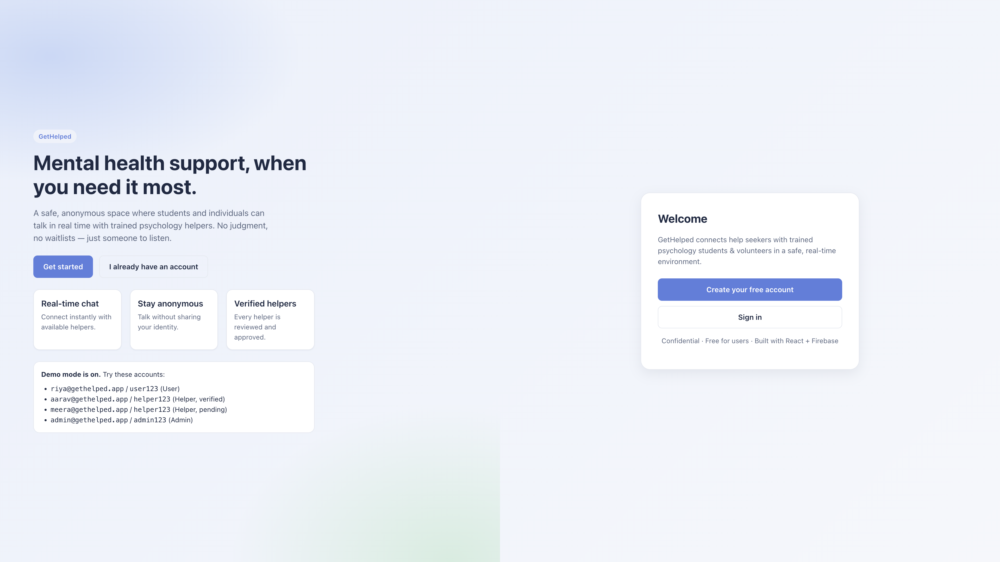

**What you see:**

- A big, calm welcome message.
- Three small boxes explaining the main promises:
  - **Real-time chat** — talk live, no waiting.
  - **Stay anonymous** — don't reveal your identity if you don't want to.
  - **Verified helpers** — every helper is checked before they can accept chats.
- Two big buttons:
  - **Get started** → opens the sign-up page.
  - **I already have an account** → opens the sign-in page.
- A small box with **demo accounts** so anyone can try the website without registering.

---

### 3.2 Create account page (registration)

This is where new people sign up.

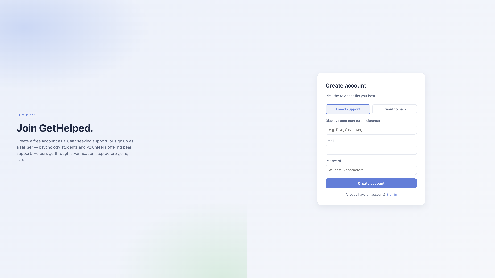

**What you can do here:**

- Pick **"I need support"** if you are looking for help.
- Pick **"I want to help"** if you are a psychology student or volunteer.
- Type a **display name** (a nickname is fine for users).
- Type your **email** and a **password** (at least 6 letters/numbers).
- Press **Create account**.

If you pick **"I want to help"**, an extra box appears for your **credentials**:

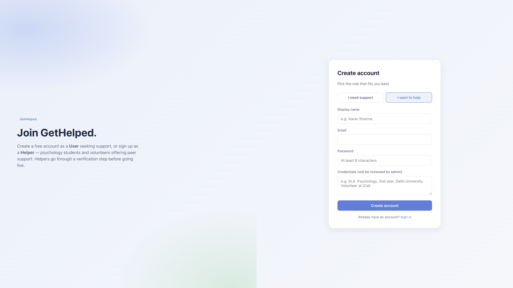

- You write your qualifications here (e.g. _"M.A. Psychology, 2nd year"_).
- The Admin will read this before approving you.
- Until approved, you can log in but cannot start helping users.

---

### 3.3 Sign-in page

If you already have an account, this is where you log in.

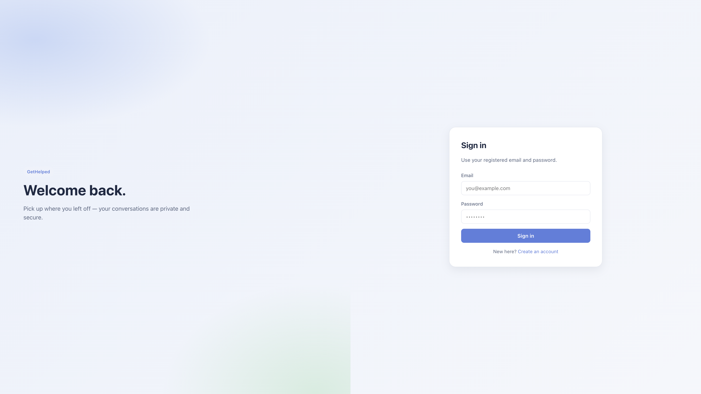

**What you do:**

1. Type your **email**.
2. Type your **password**.
3. Press **Sign in**.

The website automatically takes you to the right screen depending on your account type (User / Helper / Admin).

---

## 4. Inside the User account

This is what someone seeking support sees once they log in.

### 4.1 User dashboard (the home screen after login)

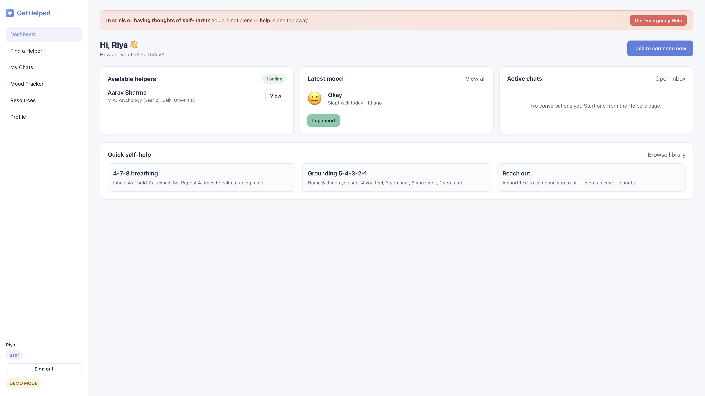

**Top of the screen — the orange Emergency Banner**
- Always visible. One tap brings up crisis helpline numbers.
- This is here on **every** page so help is never more than one click away.

**Left side — the menu** (called the sidebar)
- **Dashboard** — the screen you're on now.
- **Find a Helper** — see who is available to chat.
- **My Chats** — your list of conversations.
- **Mood Tracker** — record how you're feeling.
- **Resources** — self-help articles and breathing exercises.
- **Profile** — change your name.
- **Sign out** — log out of the website.

**Middle — three boxes**
- **Available helpers** — how many helpers are online right now.
- **Latest mood** — the last mood you logged.
- **Active chats** — your ongoing conversations.

**Bottom — quick self-help tips**
- Tiny exercises you can read in 10 seconds when you're feeling overwhelmed.

---

### 4.2 Find a Helper

This is where you choose someone to talk to.

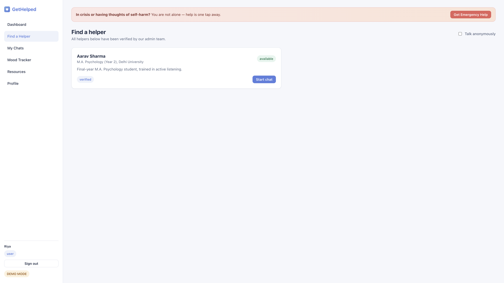

**What you see:**

- A list of **verified** helpers (the green tick means the Admin has checked them).
- Each helper card shows:
  - Their **name** and **qualification**.
  - A short **bio** about how they help.
  - A green **Available** pill or yellow **Away** pill.
- A **"Start chat"** button on each card.

#### Anonymous mode

There is a small **"Talk anonymously"** checkbox at the top right.

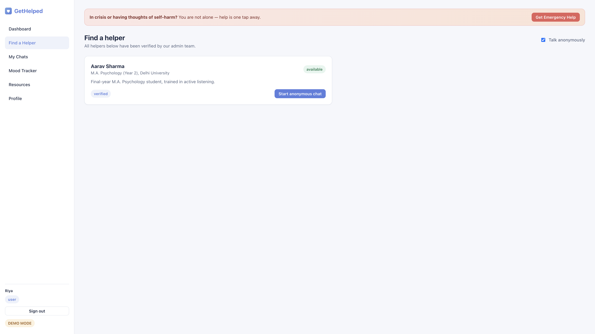

- When you tick it, the button changes to **"Start anonymous chat"**.
- The helper will see you only as **"Anonymous user"** — your name is hidden.
- You can still chat normally.

---

### 4.3 The chat screen (real-time chat)

This is the heart of the website.

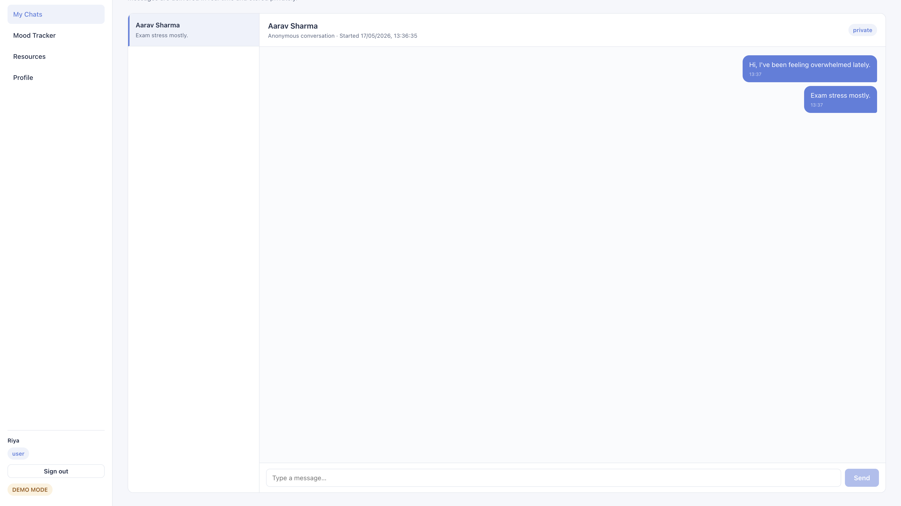

**Left side — your conversation list**
- Every chat you've started is here.
- The newest message preview is shown.
- Click any chat to open it.

**Right side — the active conversation**
- Top: name of the helper, when the chat started, a "private" badge.
- Middle: the messages.
  - Your messages appear **on the right**, in **blue**.
  - The helper's messages appear **on the left**, in **white**.
  - Each message has a small time stamp.
- Bottom: a text box and a **Send** button.

**Important:** the messages appear **instantly** for both people, like WhatsApp. No need to refresh.

---

### 4.4 Mood tracker

A simple tool to record how you're feeling each day.

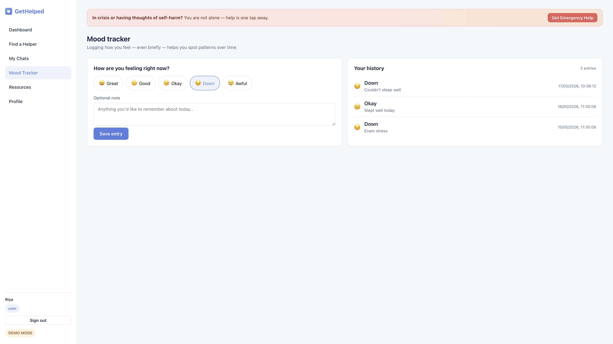

**Left side — log a new mood**
- Five buttons with faces: **Great 😄 · Good 🙂 · Okay 😐 · Down 😔 · Awful 😢**.
- Tap the one that matches your feeling.
- Add an optional note (e.g. _"Couldn't sleep"_, _"Felt good after a walk"_).
- Press **Save entry**.

**Right side — your history**
- Every entry you've ever saved, newest first.
- Helps you spot patterns over time (e.g. you feel low every Sunday night).

---

### 4.5 Resource library

Articles and exercises for self-help.

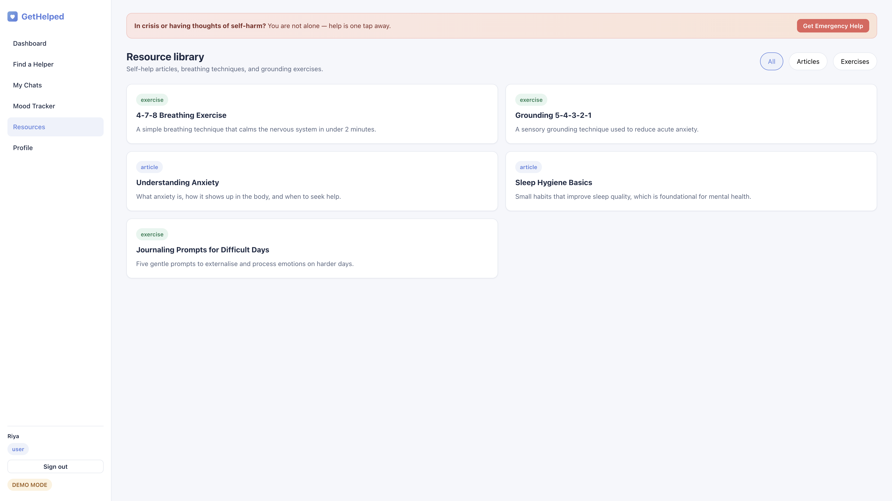

- Filter buttons at the top: **All · Articles · Exercises**.
- Each card shows a title and a one-line summary.
- Click any card to read the full content in a popup.

#### Example: 4-7-8 Breathing exercise popup

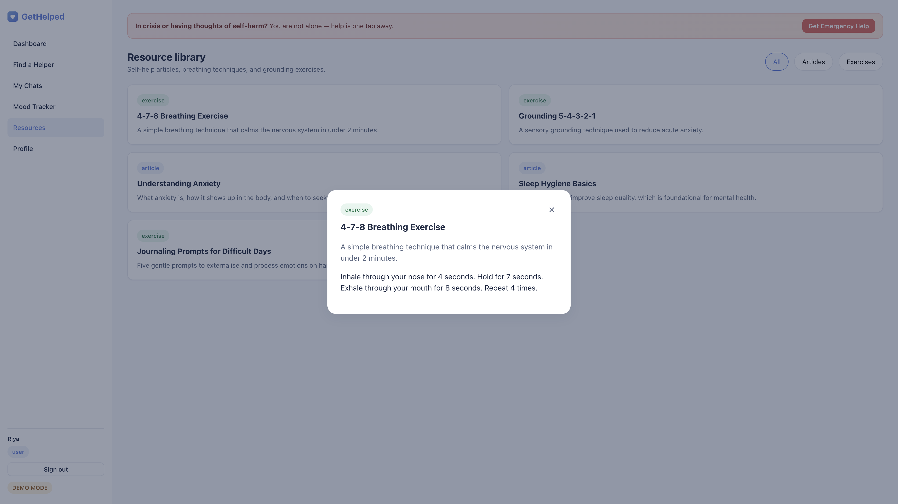

- Step-by-step instructions for a calming breathing technique.
- Press **×** in the corner to close.

The library currently includes:
- **4-7-8 Breathing Exercise** — calms a racing heart in 2 minutes.
- **Grounding 5-4-3-2-1** — pulls you back to the present moment.
- **Understanding Anxiety** — a beginner-friendly article.
- **Sleep Hygiene Basics** — habits that improve sleep.
- **Journaling Prompts for Difficult Days** — five gentle questions to write about.

---

### 4.6 Profile

This is where you update your details.

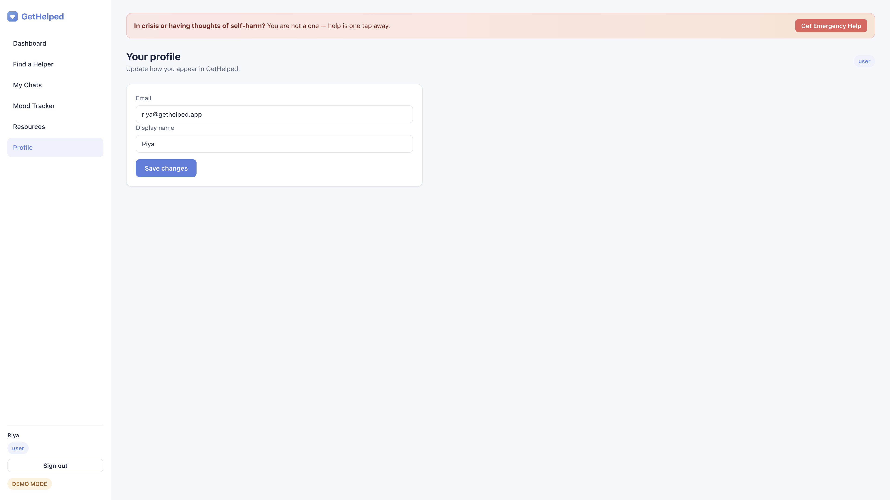

- Email is fixed (cannot change after sign-up).
- You can change your **display name**.
- The role pill (User / Helper / Admin) is shown at the top right.
- Press **Save changes** when done.

---

## 5. Inside the Helper account

This is what a psychology student / volunteer sees after logging in.

### 5.1 Helper dashboard

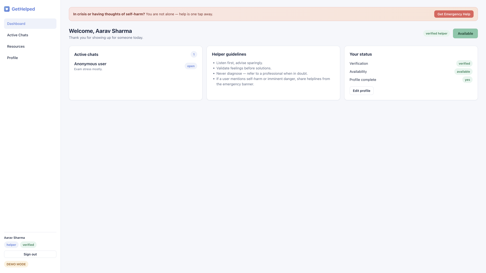

**Top of the screen:**
- A **verification pill** — green if you're verified, yellow if still pending.
- A big **Available / Go available** button — turn it on when you can chat, turn it off when you need a break.

**Three boxes:**
- **Active chats** — your ongoing conversations.
- **Helper guidelines** — short reminders (listen first, never diagnose, etc.).
- **Your status** — verification, availability, and whether your profile is complete.

**Important:** Until the Admin marks you as "verified", you cannot toggle yourself to "available". This protects users from unverified helpers.

---

### 5.2 Helper's chat list

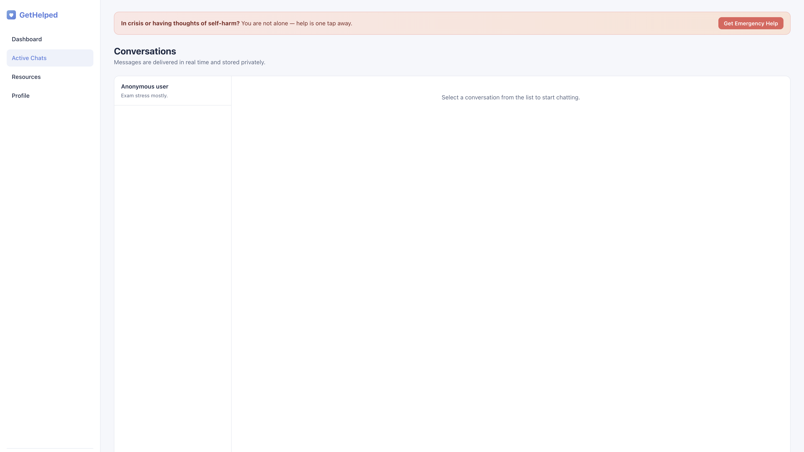

- The list on the left shows every user you're chatting with.
- If a user joined in **anonymous mode**, you see them as **"Anonymous user"** — their real name is never revealed.
- Click any conversation to open it.

---

### 5.3 Helper replying in real time

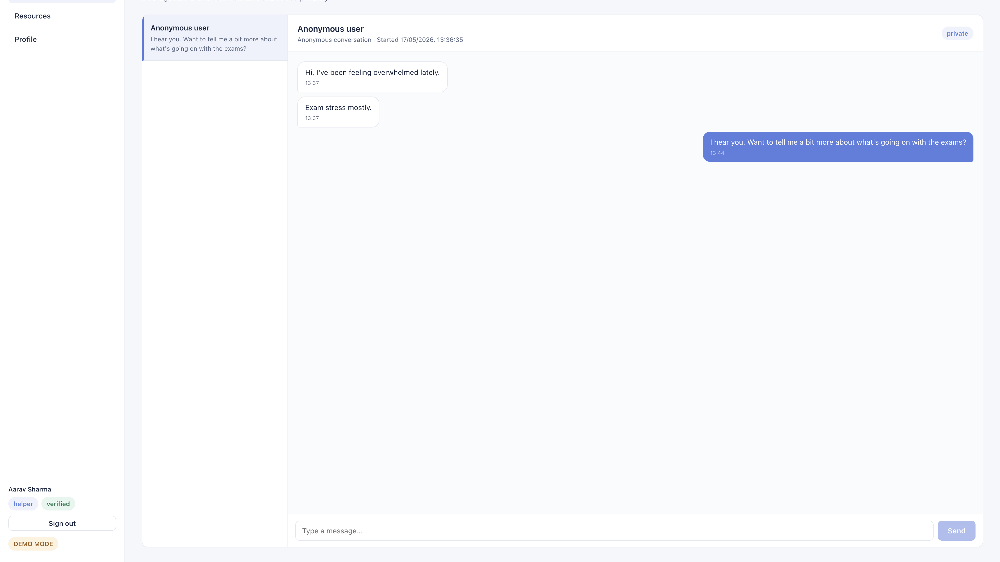

- The helper types a reply at the bottom and presses **Send**.
- The user sees the reply **immediately**, even on a different device.
- The conversation is **only visible** to these two people — no one else, not even the Admin.

---

## 6. Inside the Admin account

The Admin is the **platform manager**. Their only job is to keep the platform safe by checking helpers.

### Admin console

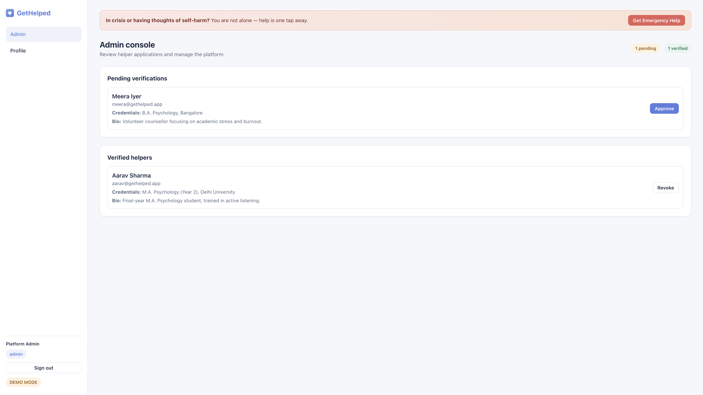

**Top of the screen:**
- **Yellow pill:** how many helpers are waiting for review.
- **Green pill:** how many are already verified.

**Section 1 — Pending verifications**
- Each pending helper card shows their **email** and **credentials** (qualifications).
- A green **Approve** button gives them access.

**Section 2 — Verified helpers**
- Already-approved helpers.
- A **Revoke** button lets the Admin remove approval if needed (e.g. complaints).

**Why this exists:**
- It is the platform's **safety net**. No unverified person can chat with a vulnerable user.

---

## 7. Safety features

This is the part that makes GetHelped trustworthy.

### 7.1 The Emergency banner — always one click away

The orange bar at the top of every signed-in screen.

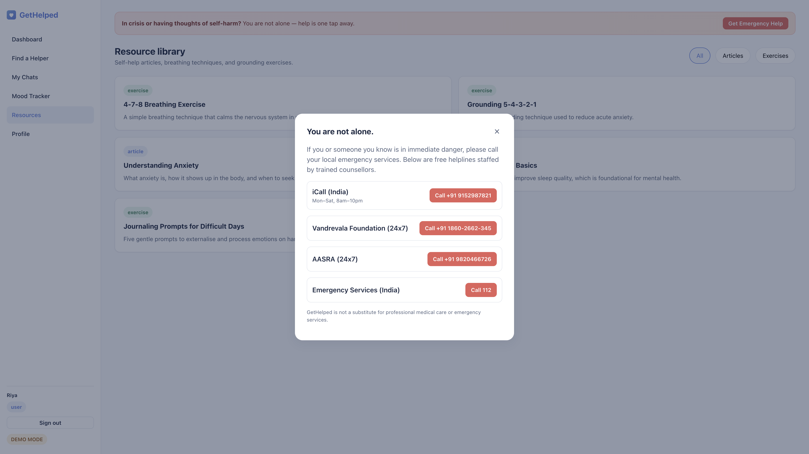

- Click **Get Emergency Help** to open the popup.
- It lists **trusted Indian crisis helplines** with their hours:
  - **iCall** — Mon–Sat, 8am–10pm
  - **Vandrevala Foundation** — 24×7
  - **AASRA** — 24×7
  - **Emergency Services (112)** — for immediate danger
- Each has a **Call** button that dials the number directly on a phone.
- A clear note at the bottom explains the platform is **not a substitute** for emergency services.

### 7.2 Verified helpers only

- Anyone can sign up to be a helper, but they cannot start chats until the Admin approves them.
- The Admin sees the helper's qualifications before deciding.

### 7.3 Anonymous chat

- The user can hide their identity when starting a chat.
- The helper sees only "Anonymous user".

### 7.4 Private conversations

- Each chat is **only readable** by the user and the helper involved.
- The Admin cannot read chats.
- Mood entries are **only readable** by their owner.
- This is enforced by the database's security rules — even a developer cannot peek at private data.

---

## 8. How the parts fit together

A simple flow chart in words:

```
┌─────────────────────┐         ┌────────────────────┐
│  User signs up      │         │  Helper signs up   │
│  (or stays anon)    │         │  + sends           │
│                     │         │  qualifications    │
└──────────┬──────────┘         └─────────┬──────────┘
           │                              │
           │                              ▼
           │                   ┌────────────────────┐
           │                   │  Admin approves /  │
           │                   │  rejects helper    │
           │                   └─────────┬──────────┘
           │                              │
           │                              ▼
           │                   ┌────────────────────┐
           │                   │  Helper toggles    │
           │                   │  themselves        │
           │                   │  available         │
           │                   └─────────┬──────────┘
           ▼                              │
┌─────────────────────────┐               │
│  User picks an          │  ◄────────────┘
│  available helper from  │
│  the list               │
└──────────┬──────────────┘
           │
           ▼
┌─────────────────────────┐
│  Real-time private chat │
│  (anonymous if chosen)  │
└──────────┬──────────────┘
           │
           ▼
┌─────────────────────────┐
│  At any moment the user │
│  can press the orange   │
│  Emergency button →     │
│  helplines              │
└─────────────────────────┘
```

---

## 9. How to run the project

For someone who has never opened a terminal before:

### Step 1 — Install Node.js
- Open a web browser.
- Go to <https://nodejs.org>
- Click the big green **LTS** download button.
- Open the downloaded file and follow the installer (just keep clicking **Next**).

### Step 2 — Open the Terminal
- On macOS: open **Terminal** from Applications → Utilities.
- On Windows: open **Command Prompt** or **PowerShell**.

### Step 3 — Run these four commands, one at a time
Type them and press **Enter** after each:

```bash
cd ~/Projects/GetHelped
npm install
npm run dev
```

- `cd` means "go into this folder".
- `npm install` downloads all the small pieces the website needs (only first time).
- `npm run dev` starts the website on your computer.

### Step 4 — Open the website
- Open a browser.
- Go to <http://localhost:5173>.
- The Landing page should appear.

### Step 5 — Try the demo accounts

| Try as… | Email                  | Password    |
| ------- | ---------------------- | ----------- |
| User    | `riya@gethelped.app`   | `user123`   |
| Helper  | `aarav@gethelped.app`  | `helper123` |
| Admin   | `admin@gethelped.app`  | `admin123`  |

To stop the website later, go back to the Terminal and press **Ctrl + C**.

---

## 10. Glossary (easy meanings)

| Word | What it means |
|---|---|
| **Frontend** | The parts you can see and click — the buttons, pages, colors. |
| **Backend** | The invisible part that stores data and sends messages. |
| **Database** | A big organised filing cabinet inside the computer. |
| **Real-time** | Happens **immediately** — no waiting, no refresh. |
| **Anonymous** | Without revealing your name. |
| **Verified** | Checked and approved by the Admin. |
| **Authentication** | The login process — proving you are who you say you are. |
| **Dashboard** | The home screen after you log in. |
| **Sidebar** | The menu on the left of the screen. |
| **Modal / Popup** | A small box that opens on top of the page. |
| **Pill** | The small rounded label (e.g. "available", "verified"). |

---

## Quick links

- Project home: this folder (`~/Projects/GetHelped`)
- Setup & developer notes: [`README.md`](../README.md)
- Feature checklist mapped to synopsis: [`Features.md`](Features.md)
- All screenshots: [`screenshots/`](screenshots)

---

_Last updated: 17 May 2026_
